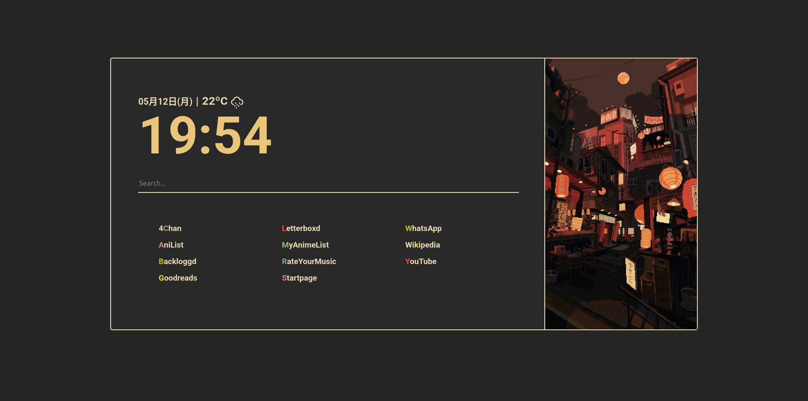

# mthus' cool startpage

This is a simple little browser startpage I made using HTML, CSS and JavaScript.

The goal was to make this as keyboard-centric as possible, so basically every action can be performed with a single keypress.

### Here's what it kinda looks like:

## Other cool features include:
- Shortcut keys are highlighted in a random color everytime.
- For supported sites, lower case shortcuts make the search bar search the shortcut website in question.
- Upper case shortcuts take you to the website directly.
- 4chan shortcut (did this for a friend I don't use this website I swear) takes you to the board typed in the search bar.
- Add new links just by adding the name in the site list with the highlited letter preceded by an \*.

Side-image artwork by [waneella](https://waneella.com/)
